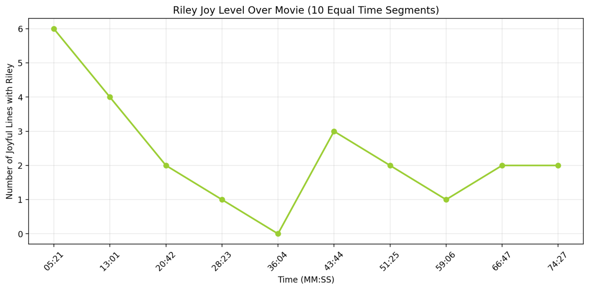

### Part 1: Introduction & Features


# Movie Emotion Detector from Subtitle for InsideOut

This project analyzes emotions in movie subtitles using an emotion classification model. It processes `.srt` subtitle files and predicts the emotions for each subtitle line along with their confidence scores. The results are saved in a CSV file for further analysis or visualization.

## Features
- **Subtitle Parsing**: Reads `.srt` subtitle files and extracts the timestamp and subtitle text.
- **Emotion Analysis**: Uses the pre-trained `j-hartmann/emotion-english-distilroberta-base` model from Hugging Face's Transformers library to classify emotions in each subtitle line.
- **Result Export**: Saves the analysis results (emotion, confidence score, timestamp) to a CSV file for visualization and further processing.


### Part 2: Requirements & Setup


## Requirements

- Python 3.7+
- `pandas`
- `transformers`
- `torch`
- `re` (built-in Python library)
- `matplotlib`
- `plotly`
- `streamlit`

To install the required libraries, run the following command:

```bash
pip install -r requirements.txt
````

## Setup Instructions

1. Clone this repository to your local machine:

```bash
git clone https://github.com/yourusername/movie-emotion-detector.git
cd movie-emotion-detector
```

2. Install the required Python dependencies:

```bash
pip install -r requirements.txt
```

3. Place your `.srt` subtitle file (e.g., `inside.srt` from the movie *Inside Out*) in the project directory.

4. Run the emotion analysis script:

```bash
python emotion_analysis.py
```

This will generate the `emotion_results_with_time.csv` file, which contains the timestamp, subtitle line, detected emotion, and the confidence score.


### Part 3: File Structure, Model, Example Usage & License

## File Structure

````

movie-emotion-detector/
│
├── emotion\_analysis.py        # Script for subtitle parsing and emotion detection
├── emotion\_results\_with\_time.csv # CSV file containing the emotion analysis results
├── requirements.txt           # Python dependencies
├── README.md                 # This file
└── inside.srt                 # Example subtitle file from the movie 'Inside Out' (you can replace this with your own)

````

## Emotion Model

This project uses the **Emotion-Detection** model from Hugging Face:

* Model: [`j-hartmann/emotion-english-distilroberta-base`](https://huggingface.co/j-hartmann/emotion-english-distilroberta-base)
* The model classifies text into various emotions including: `anger`, `fear`, `joy`, `sadness`, etc.

## Example Usage

For a subtitle file `inside.srt` (example from the animated movie *Inside Out*):

### Input

```srt
1
00:00:01,000 --> 00:00:03,000
I feel so happy today!

2
00:00:04,000 --> 00:00:06,000
This is a terrible situation.
````

### Output in `emotion_results_with_time.csv`

| time  | line                          | emotion | score |
| ----- | ----------------------------- | ------- | ----- |
| 1.000 | I feel so happy today!        | joy     | 0.95  |
| 4.000 | This is a terrible situation. | fear    | 0.89  |

## Visualizations 

You can visualize the emotion distribution and time-based analysis using `Streamlit`. To run the dashboard:



In Inside Out, we watch Riley’s journey as she slowly sinks into sadness while facing big life changes, but as the story unfolds and reaches its beautiful ending, she rediscovers joy, healing, and happiness within herself. It’s a touching reminder that even in our hardest moments, light and hope can return:)

1. Install Streamlit:

```bash
pip install streamlit
```

2. Run the Streamlit app:

```bash
streamlit run dashboard.py
```

This will open an interactive dashboard in your browser where you can explore various emotion-related plots like:

* **Emotion distribution** (Radar chart)
* **Fear level over time** (Line chart)
* **Riley's joy over time** (Line chart)
* **Average emotion score for Riley** (Bar chart)

## License

This project is licensed under the MIT License - see the [LICENSE](LICENSE) file for details.


